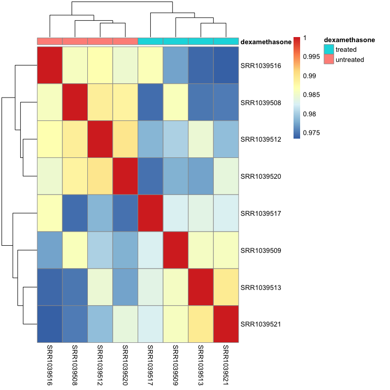
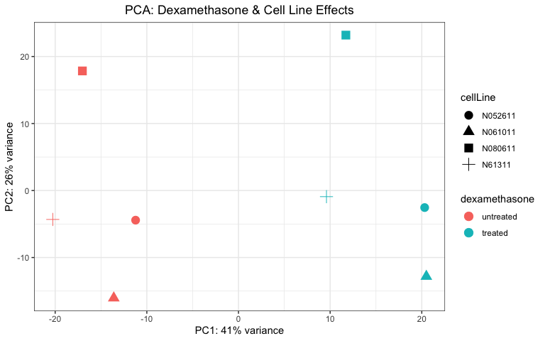
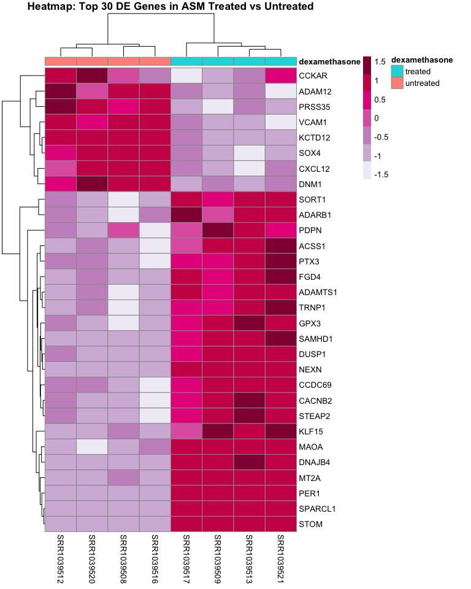
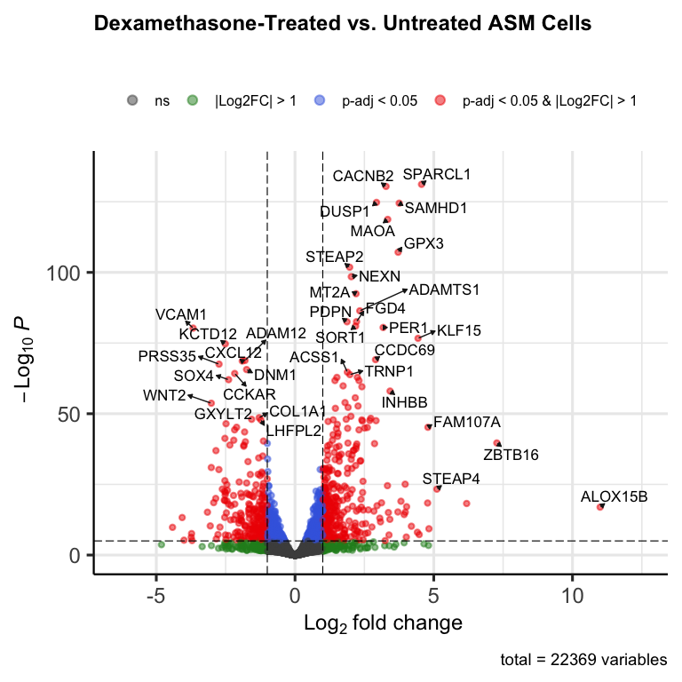
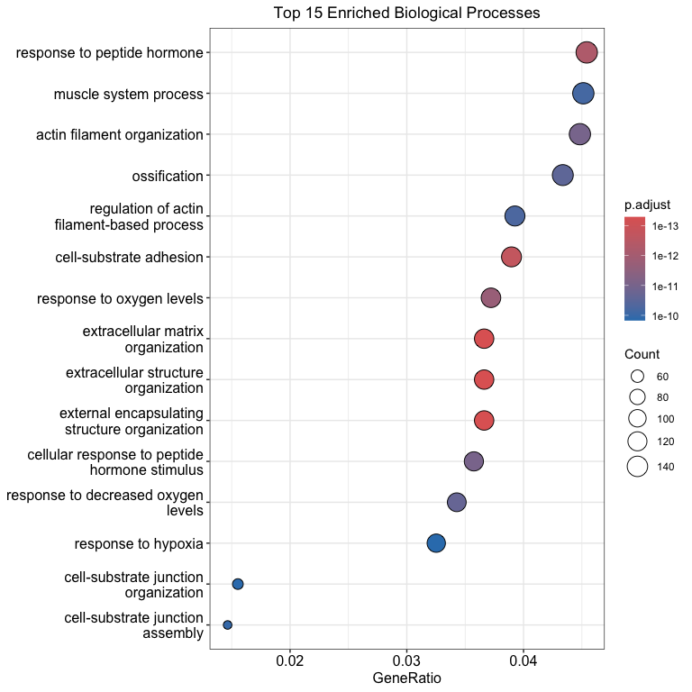

airway_rnaseq
================
Reuben Quek
2026-09-09

# Airway RNAseq Analysis

Bulk RNA-seq was performed on four human airway smooth muscle (ASM) cell
lines under two conditions: <u>**untreated**</u> & <u>**treated**</u>
(with dexamethasone). The goal of this analysis is to assess the
<u>**transcriptional response**</u> of ASM cells to synthetic
glucocorticoid exposure. (<u>GEO: GSE52778</u>)

Utilising the `DESeq2` framework, quality control of the datasets are
performed, differentially-expressed genes were identified, and
downstream pathway enrichment analysis was conducted to identify
functional changes and biological themes underlying the phenotype.

## Loading Libraries

Load the packages required to run the DESeq analysis.

``` r
suppressPackageStartupMessages({
  library(org.Hs.eg.db)
  library(AnnotationDbi)
  library(DESeq2)
  library(tidyverse)
  library(RColorBrewer)
  library(pheatmap)
  library(ggplot2)
  library(EnhancedVolcano)
})
```

    ## Warning: package 'AnnotationDbi' was built under R version 4.5.2

    ## Warning: package 'S4Vectors' was built under R version 4.5.3

    ## Warning: package 'DESeq2' was built under R version 4.5.2

    ## Warning: package 'GenomicRanges' was built under R version 4.5.2

    ## Warning: package 'ggplot2' was built under R version 4.5.2

    ## Warning: package 'tibble' was built under R version 4.5.2

    ## Warning: package 'tidyr' was built under R version 4.5.2

    ## Warning: package 'readr' was built under R version 4.5.2

    ## Warning: package 'purrr' was built under R version 4.5.2

    ## Warning: package 'dplyr' was built under R version 4.5.2

    ## Warning: package 'lubridate' was built under R version 4.5.2

    ## Warning: package 'EnhancedVolcano' was built under R version 4.5.2

    ## Warning: package 'ggrepel' was built under R version 4.5.2

### Loading Data

Load the counts, coldata (metadata), and rowdata (gene annotation) as
data frames.

``` r
countsdata <- read.csv("data/counts_data.csv")
head(countsdata)
```

    ##                 SRR1039508 SRR1039509 SRR1039512 SRR1039513 SRR1039516
    ## ENSG00000000003        679        448        873        408       1138
    ## ENSG00000000005          0          0          0          0          0
    ## ENSG00000000419        467        515        621        365        587
    ## ENSG00000000457        260        211        263        164        245
    ## ENSG00000000460         60         55         40         35         78
    ## ENSG00000000938          0          0          2          0          1
    ##                 SRR1039517 SRR1039520 SRR1039521
    ## ENSG00000000003       1047        770        572
    ## ENSG00000000005          0          0          0
    ## ENSG00000000419        799        417        508
    ## ENSG00000000457        331        233        229
    ## ENSG00000000460         63         76         60
    ## ENSG00000000938          0          0          0

``` r
coldata <- read.csv("data/sample_info.csv")
head(coldata)
```

    ##            cellLine dexamethasone
    ## SRR1039508   N61311     untreated
    ## SRR1039509   N61311       treated
    ## SRR1039512  N052611     untreated
    ## SRR1039513  N052611       treated
    ## SRR1039516  N080611     untreated
    ## SRR1039517  N080611       treated

``` r
rowdata <- read.csv("data/row_data.csv")
head(rowdata)
```

    ##                         gene_id gene_name entrezid   gene_biotype
    ## ENSG00000000003 ENSG00000000003    TSPAN6       NA protein_coding
    ## ENSG00000000005 ENSG00000000005      TNMD       NA protein_coding
    ## ENSG00000000419 ENSG00000000419      DPM1       NA protein_coding
    ## ENSG00000000457 ENSG00000000457     SCYL3       NA protein_coding
    ## ENSG00000000460 ENSG00000000460  C1orf112       NA protein_coding
    ## ENSG00000000938 ENSG00000000938       FGR       NA protein_coding
    ##                 gene_seq_start gene_seq_end seq_name seq_strand
    ## ENSG00000000003       99883667     99894988        X         -1
    ## ENSG00000000005       99839799     99854882        X          1
    ## ENSG00000000419       49551404     49575092       20         -1
    ## ENSG00000000457      169818772    169863408        1         -1
    ## ENSG00000000460      169631245    169823221        1          1
    ## ENSG00000000938       27938575     27961788        1         -1
    ##                 seq_coord_system   symbol
    ## ENSG00000000003               NA   TSPAN6
    ## ENSG00000000005               NA     TNMD
    ## ENSG00000000419               NA     DPM1
    ## ENSG00000000457               NA    SCYL3
    ## ENSG00000000460               NA C1orf112
    ## ENSG00000000938               NA      FGR

### Constructing DESeq Object

Before creating the DESeq object for analysis, first check that the
sample names align for:

- column names of `countsdata`, row names of `coldata`

- row names of `rowdata` and `countsdata`

``` r
# same name and order
all(rownames(coldata) == colnames(countsdata))
```

    ## [1] TRUE

``` r
all(rownames(rowdata) == rownames(countsdata))
```

    ## [1] TRUE

``` r
dds <- DESeqDataSetFromMatrix(
  countData=countsdata,
  colData=coldata,
  rowData=rowdata,
  design=~cellLine+dexamethasone 
  )
```

    ## Warning in DESeqDataSet(se, design = design, ignoreRank): some variables in
    ## design formula are characters, converting to factors

Next, the factors are re-levelled before running analysis (“treated”
comes before “untreated” alphabetically, which will mess up the
baseline).

``` r
colData(dds)$dexamethasone <- relevel(colData(dds)$dexamethasone, ref = "untreated")
```

### Exploratory Analysis / Quality Control

First, filter out the genes with an insufficient count, setting the
minimum count to <u>**10**</u>.

``` r
nrow(dds) # prints out initial number of rows 
```

    ## [1] 63677

``` r
keep <- rowSums(counts(dds)) >= 10 # boolean logic, used to subset
dds <- dds[keep, ]
nrow(dds)
```

    ## [1] 22369

#### Clustering Heatmap

Use DESeq’s <u>variance stabilising transform</u> (VST) before
performing QC.

``` r
vsd <- vst(dds, blind=TRUE)
```

Next, extract the counts of the variance-transformed data (vsd), and
`cor()` is used to compute the correlation coefficient (Pearson’s r) to
compare the expression profiles of the various samples.

``` r
vsd_mat <- assay(vsd)
vsd_cor <- cor(vsd_mat)

pheatmap(vsd_cor, 
         annotation = coldata["dexamethasone"])
```

<!-- -->

Sample-to-sample correlation shows high overall concordance
($r > 0.975$) and no apparent outliers. Hierarchical clustering cleanly
separates samples by treatment condition (dexamethasone-treated
vs. untreated). Coordinated sub-clustering among matched samples
reflects the donor cell line effect, confirming that `cell` should be
included as a blocking factor in the `DESeq2` design formula
(`~ cell + dexamethasone`).

#### Principal Component Analysis (PCA)

Next, plot the PCA to view the clustering of the various samples.

``` r
pca_data <- plotPCA(
  vsd,
  intgroup=c("dexamethasone", "cellLine"),
  returnData=TRUE
)
```

    ## using ntop=500 top features by variance

``` r
percentVar <- round(100*attr(pca_data, "percentVar")) # names(attributes(pca_data)) to access attributes

ggplot(pca_data, aes(x=PC1, y=PC2, color=dexamethasone, shape=cellLine)) +
  geom_point(size=4) +
  xlab(paste0("PC1: ", percentVar[1], "% variance")) +
  ylab(paste0("PC2: ", percentVar[2], "% variance")) +
  theme_bw() +
  ggtitle("PCA: Dexamethasone & Cell Line Effects") +
  theme(plot.title = element_text(hjust = 0.5))
```

<!-- -->

PC1 (41% variance) separates treatment, which confirms dexamethasone as
the primary driver of transcriptional change. PC2 (26% variance)
reflects the cell line differences: paired samples from the same donor
share similar vertical positions along PC2.

### Run DESeq Analysis

``` r
dds <- DESeq(dds)
```

    ## estimating size factors

    ## estimating dispersions

    ## gene-wise dispersion estimates

    ## mean-dispersion relationship

    ## final dispersion estimates

    ## fitting model and testing

``` r
res <- results(
  object=dds,
  contrast=c("dexamethasone", "treated", "untreated"),
  alpha=0.05
)
summary(res)
```

    ## 
    ## out of 22369 with nonzero total read count
    ## adjusted p-value < 0.05
    ## LFC > 0 (up)       : 2208, 9.9%
    ## LFC < 0 (down)     : 1822, 8.1%
    ## outliers [1]       : 0, 0%
    ## low counts [2]     : 5204, 23%
    ## (mean count < 6)
    ## [1] see 'cooksCutoff' argument of ?results
    ## [2] see 'independentFiltering' argument of ?results

``` r
plotMA(res)
```

<!-- -->

``` r
res_shrunk <- lfcShrink(
  dds,
  coef="dexamethasone_treated_vs_untreated",
  res=res
)
```

    ## using 'apeglm' for LFC shrinkage. If used in published research, please cite:
    ##     Zhu, A., Ibrahim, J.G., Love, M.I. (2018) Heavy-tailed prior distributions for
    ##     sequence count data: removing the noise and preserving large differences.
    ##     Bioinformatics. https://doi.org/10.1093/bioinformatics/bty895

``` r
plotMA(res_shrunk)
```

<!-- -->

``` r
summary(res_shrunk)
```

    ## 
    ## out of 22369 with nonzero total read count
    ## adjusted p-value < 0.05
    ## LFC > 0 (up)       : 2208, 9.9%
    ## LFC < 0 (down)     : 1822, 8.1%
    ## outliers [1]       : 0, 0%
    ## low counts [2]     : 5204, 23%
    ## (mean count < 6)
    ## [1] see 'cooksCutoff' argument of ?results
    ## [2] see 'independentFiltering' argument of ?results

``` r
head(res_shrunk)
```

    ## log2 fold change (MAP): dexamethasone treated vs untreated 
    ## Wald test p-value: dexamethasone treated vs untreated 
    ## DataFrame with 6 rows and 5 columns
    ##                  baseMean log2FoldChange     lfcSE      pvalue        padj
    ##                 <numeric>      <numeric> <numeric>   <numeric>   <numeric>
    ## ENSG00000000003  708.5979     -0.3640838 0.1000795 1.53286e-04 1.22779e-03
    ## ENSG00000000419  520.2963      0.1864336 0.1081165 6.50354e-02 1.87583e-01
    ## ENSG00000000457  237.1621      0.0310729 0.1300506 7.90437e-01 9.04243e-01
    ## ENSG00000000460   57.9324     -0.0471496 0.2123688 7.56024e-01 8.86519e-01
    ## ENSG00000000971 5817.3108      0.4025264 0.0886677 1.57266e-06 1.96467e-05
    ## ENSG00000001036 1282.1007     -0.2279666 0.0873527 6.75809e-03 3.20095e-02

Next, the shrunken results will be converted into a data frame, and
using rowData of dds, transfer the corresponding gene `symbols` and
`gene_biotype` to `res_df`.

``` r
# convert the results object to a standard data frame
res_df <- as.data.frame(res_shrunk)

# add the gene symbol and gene_biotype to res_df
symbol <- rowData(dds)$gene_name[match(rownames(res_df), rownames(dds))]
res_df$symbol <- symbol

biotype <- rowData(dds)$gene_biotype[match(rownames(res_df), rownames(dds))]
res_df$gene_biotype <- biotype
```

Next, the DEGs from `res_df` will be filtered out (padj \< 0.05), and
then arranged based on the padj value:

``` r
degs <- res_df |> 
  filter(!is.na(padj), padj < 0.05) |> 
  arrange(padj)

head(degs)
```

    ##                   baseMean log2FoldChange     lfcSE        pvalue          padj
    ## ENSG00000152583   997.4447       4.559848 0.1858830 4.110667e-136 7.055960e-132
    ## ENSG00000165995   495.0957       3.280119 0.1332056 4.463384e-135 3.830700e-131
    ## ENSG00000120129  3409.0384       2.936591 0.1225024 3.033840e-129 1.735862e-125
    ## ENSG00000101347 12703.4128       3.754342 0.1576101 7.682657e-129 3.296820e-125
    ## ENSG00000189221  2341.7807       3.341300 0.1432340 5.212706e-123 1.789522e-119
    ## ENSG00000211445 12285.7001       3.716111 0.1684827 2.585059e-111 7.395423e-108
    ##                  symbol   gene_biotype
    ## ENSG00000152583 SPARCL1 protein_coding
    ## ENSG00000165995  CACNB2 protein_coding
    ## ENSG00000120129   DUSP1 protein_coding
    ## ENSG00000101347  SAMHD1 protein_coding
    ## ENSG00000189221    MAOA protein_coding
    ## ENSG00000211445    GPX3 protein_coding

Next, the top 30 DE genes will be extracted to build an annotated
heatmap, constructed using the vsd data subsetted to the top 30 genes.

``` r
# grab the Ensembl IDs to subset the matrix (since vsd uses Ensembl IDs)
top_genes <- rownames(degs)[1:min(30, nrow(degs))] # in case < 30 DE genes
mat <- vsd_mat[top_genes, ]

# grab the corresponding gene symbols
top_symbols <- degs$symbol[1:min(30, nrow(degs))]

# safety check: If a gene doesn't have a symbol, keep its Ensembl ID so it isn't NA
top_symbols <- ifelse(is.na(top_symbols), top_genes, top_symbols)

# swap the row names from Ensembl ID to symbols
rownames(mat) <- top_symbols

pheatmap(
  mat,
  scale = "row", # calculates Z-score across each row
  color=brewer.pal(7, "PuRd"),
  annotation_col = dplyr::select(coldata, dexamethasone),
  show_rownames = TRUE, # This will now display top_symbols
  cluster_cols = TRUE,
  cluster_rows = TRUE,
  main="Heatmap: Top 30 DE Genes in ASM Treated vs Untreated"
)
```

<!-- -->

#### Volcano Plot

A volcano plot will be plotted to visualise the differentially expressed
genes between the various treatment conditions.

``` r
EnhancedVolcano(
  res_df,
  lab=res_df$symbol,
  x="log2FoldChange",
  y="padj",
  labSize=4.5,
  legendLabels=c(
    "ns",
    "|Log2FC| > 1",
    "p-adj < 0.05",
    "p-adj < 0.05 & |Log2FC| > 1"),
  title="Dexamethasone-Treated vs. Untreated ASM Cells",
  legendIconSize=3,
  legendLabSize=12,
  subtitle="",
  drawConnectors=TRUE,
  pointSize=1.5
  )
```

    ## Warning: Using `size` aesthetic for lines was deprecated in ggplot2 3.4.0.
    ## ℹ Please use `linewidth` instead.
    ## ℹ The deprecated feature was likely used in the EnhancedVolcano package.
    ##   Please report the issue to the authors.
    ## This warning is displayed once per session.
    ## Call `lifecycle::last_lifecycle_warnings()` to see where this warning was
    ## generated.

    ## Warning: The `size` argument of `element_line()` is deprecated as of ggplot2 3.4.0.
    ## ℹ Please use the `linewidth` argument instead.
    ## ℹ The deprecated feature was likely used in the EnhancedVolcano package.
    ##   Please report the issue to the authors.
    ## This warning is displayed once per session.
    ## Call `lifecycle::last_lifecycle_warnings()` to see where this warning was
    ## generated.

<!-- -->

### Gene Set Enrichment Analysis (GSEA)

``` r
suppressPackageStartupMessages({
  library(clusterProfiler)
  library(enrichplot)
})
```

    ## Warning: package 'clusterProfiler' was built under R version 4.5.3

    ## Warning: package 'enrichplot' was built under R version 4.5.2

``` r
# Extract significant Ensembl IDs
sig_genes <- rownames(degs)

# Convert Ensembl IDs to Entrez IDs
entrez_ids <- mapIds(org.Hs.eg.db,
                     keys = sig_genes,
                     column = "ENTREZID",
                     keytype = "ENSEMBL",
                     multiVals = "first")
```

    ## 'select()' returned 1:many mapping between keys and columns

``` r
# Remove NAs from failed mappings
entrez_ids <- na.omit(entrez_ids)
```

``` r
# Run GO Enrichment Analysis
ego <- enrichGO(gene          = entrez_ids,
                OrgDb         = org.Hs.eg.db,
                ont           = "BP", # Focuses on Biological Processes
                pAdjustMethod = "BH",
                pvalueCutoff  = 0.05,
                qvalueCutoff  = 0.05,
                readable      = TRUE) # Maps Entrez back to symbols for clean plots
```

``` r
# Generate a dotplot of the top enriched pathways
dotplot(ego, showCategory = 15) + 
  ggtitle("Top 15 Enriched Biological Processes") +
  theme(plot.title = element_text(hjust = 0.5))
```

<!-- -->

### Conclusions / Discussions

The exploratory sample-level analyses—spanning sample distance
clustering and principal component analysis—demonstrate robust data
quality with high replicate concordance and no outlier samples. The
primary axis of variation corresponds directly to treatment status,
while secondary clustering reflects cell line-specific differences.
Together, these diagnostic checks validate the integrity of the count
data and confirm that a paired design formula (`~ cell + dexamethasone`)
is appropriate for controlling biological background variation in
downstream differential expression testing.
